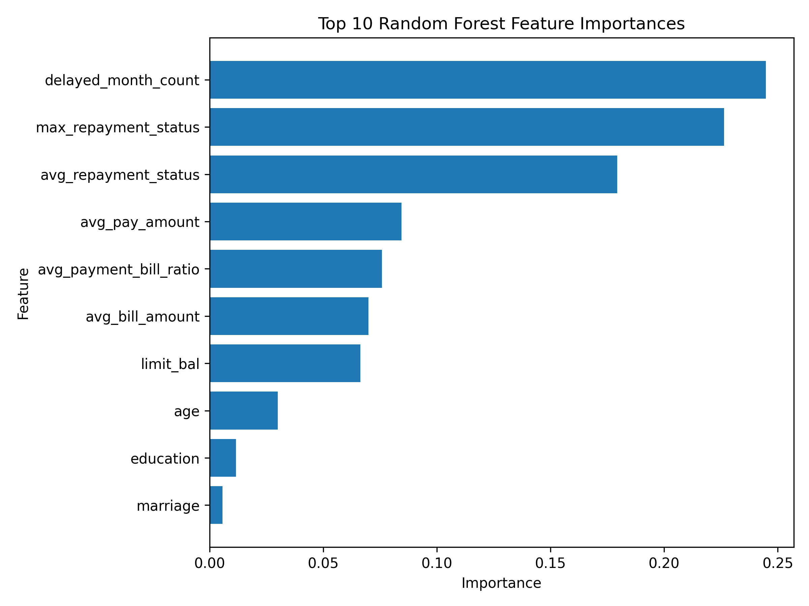

# New Model Helps Identify Which Credit Card Clients Are More Likely to Default

## Hook

A missed payment may seem small at first, but repeated repayment problems can be an early warning sign of much larger financial risk. This project uses client repayment history, bill information, and account data to better understand which credit card clients are more likely to default on payment next month.

## Problem Statement

Lenders need better ways to identify clients who may be at higher risk of default. Looking at only one variable, such as age or credit limit, is usually not enough. Default risk is often connected to a pattern of recent financial behavior, including delayed payments, monthly bills, and payment amounts.

This project focuses on a specific question: can demographic information, credit limit, repayment history, and financial behavior from the previous six months help predict whether a client will default next month? To answer this question, I used the UCI Credit Card Default dataset and restructured the original data into relational tables so that monthly repayment and financial records could be summarized more clearly for analysis.

## Solution Description

To study this problem, I built a machine learning pipeline using DuckDB, SQL, Python, and a random forest classifier. The original wide dataset was reorganized into four relational tables: `clients`, `credit_accounts`, `repayment_history`, and `monthly_financials`. These tables were then combined into a client-level modeling table with summary features such as delayed month count, average repayment status, and average payment-to-bill ratio.

The final model achieved an accuracy of 0.747 and a ROC AUC of 0.766, showing that it can distinguish between default and non-default clients reasonably well. The model’s recall was 0.625, meaning it identified about 62.5% of actual default cases. This suggests that repayment history and recent financial behavior provide meaningful signals for credit risk screening.

## Chart

The feature importance results show that repayment-related variables were the strongest predictors in the model. The three most important features were:

- `delayed_month_count`
- `max_repayment_status`
- `avg_repayment_status`

These results suggest that recent repayment behavior is more informative than demographic variables such as age, education, or marriage status when predicting future default risk.

## Why It Matters

This project shows that credit default risk is better understood as a behavioral pattern rather than as a fixed personal characteristic. By focusing on recent repayment problems and financial stress signals, lenders can make more informed risk assessments. This project demonstrates how relational data design, SQL-based feature engineering, and machine learning can work together in a practical credit risk prediction task.